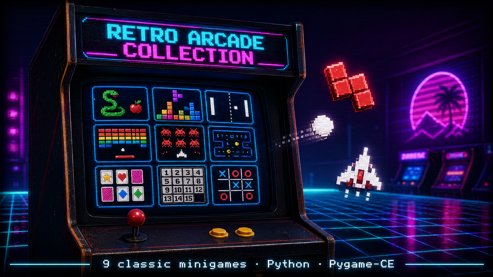

# 🕹️ Retro Arcade Collection

> Una raccolta di 9 minigiochi arcade classici, realizzati in Python con Pygame-CE, con launcher unificato in stile retro CRT.




---

## ✨ Highlights

- 🎮 **9 giochi classici** in un unico launcher con estetica retro (scanline CRT, palette neon, vignettatura)
- 🧠 **Motore AI condiviso** con 4 algoritmi (Random, Heuristic, Minimax, Alpha-Beta con iterative deepening)
- 🎨 **Architettura pulita**: dispatch pattern centralizzato, modulo condiviso per UI, LRU font cache
- 💾 **Persistenza degli high score** su JSON
- 📦 **Build pronta** con PyInstaller per generare eseguibili standalone

## 🎮 Giochi inclusi

| Gioco | Caratteristiche principali |
|-------|---------------------------|
| **Snake** | Effetti particellari, gradiente colore sul corpo, frutto bonus a tempo |
| **Tetris** | Hold piece, ghost piece, preview, sistema di livelli, line clear animation |
| **Pong** | 3 modalità (1P, 2P, VS AI), effetto scia, AI con 3 livelli di difficoltà |
| **Breakout** | Mattoni a resistenza multipla, vite, accelerazione progressiva |
| **Space Invaders** | Nemici che sparano, ondate progressive, sistema vite |
| **Maze Runner** | Labirinti generati con DFS, 3 difficoltà, breadcrumb del percorso |
| **Memory Game** | Carte colorate con animazione flip, contatore mosse |
| **Puzzle 15** | Verifica risolvibilità, animazione smooth tessere, timer |
| **Tic Tac Toe** | AI Minimax/Alpha-Beta, 3 modalità, score tracking persistente |

## 🚀 Installazione

### Requisiti

- Python **3.10** o superiore
- pip

### Setup

```bash
# Clona la repo
git clone https://github.com/sirAlfry/retro-arcade-collection.git
cd retro-arcade-collection

# (Consigliato) Crea un virtual environment
python -m venv venv

# Attiva il venv
# Windows:
venv\Scripts\activate
# macOS/Linux:
source venv/bin/activate

# Installa le dipendenze
pip install -r requirements.txt
```

### Avvio

```bash
python retro_arcade_interface.py
```

## 🎯 Controlli del launcher

| Tasto | Azione |
|-------|--------|
| ⬆️ ⬇️ ⬅️ ➡️ | Naviga tra i giochi |
| `Invio` / `Spazio` | Avvia il gioco selezionato |
| `C` | Mostra crediti |
| `ESC` | Esci |

I controlli specifici di ogni gioco vengono mostrati nel pannello informativo del launcher e nel menu pausa (`ESC` durante il gioco).

## 🏗️ Architettura

```
retro-arcade-collection/
├── retro_arcade_interface.py   # Launcher principale con dispatch pattern
├── game_shared.py              # UI condivisa, menu, font cache LRU, costanti
├── game_ai.py                  # Motore AI: Random / Heuristic / Minimax / Alpha-Beta
├── snake.py                    # Singoli giochi…
├── tetris.py
├── pong.py
├── breakout.py
├── space_invaders.py
├── maze_runner.py
├── memory_game.py
├── puzzle15.py
├── tris.py
├── scores.json                 # Generato a runtime (non versionato)
├── requirements.txt
├── docs/
│   └── GDD_retro_arcade_collection.docx   # Game Design Document completo
├── tools/                      # Utility di sviluppo (non parte del gioco)
│   ├── clean_nulls.py
│   ├── fix_encoding.py
│   └── README.md
└── build/                      # Spec PyInstaller per creare eseguibili
    ├── retro_arcade_interface.spec
    └── RetroArcadeCollection.spec
```

### Pattern architetturali utilizzati

- **Dispatch Pattern**: un singolo `GAME_DISPATCH` dict mappa ogni gioco a `(modulo, funzione, richiede_punteggi)`, eliminando codice duplicato. L'import è dinamico via `__import__()`.
- **LRU Font Cache**: `safe_font()` in `game_shared.py` usa `OrderedDict` come cache LRU con capacità 20, riducendo l'overhead di creazione font con fallback automatico (Consolas → Arial → DejaVu Sans → FreeSans → system default).
- **AI Engine pluggable**: `game_ai.py` espone una classe `GameAI` configurabile per algoritmo, difficoltà e timeout. Le classi usano `__slots__` per efficienza memoria.
- **Persistenza disaccoppiata**: i giochi ricevono `load_scores`/`save_scores` come callable, senza conoscere il backend di storage.

## 📦 Build eseguibile

Per generare un eseguibile standalone:

```bash
pip install pyinstaller
pyinstaller build/RetroArcadeCollection.spec
```

L'eseguibile sarà in `dist/`.

## 📖 Game Design Document

Per i dettagli completi su design, scelte tecniche e roadmap: vedi [docs/GDD_retro_arcade_collection.docx](docs/GDD_retro_arcade_collection.docx).

## 🛠️ Stack tecnologico

- **Linguaggio**: Python 3.10+
- **Game library**: Pygame-CE (Community Edition)
- **Build**: PyInstaller
- **Persistenza**: JSON

## 🗺️ Roadmap

- [ ] Aggiungere screenshot e GIF dei giochi nel README
- [ ] Audio: musiche di sottofondo e SFX per ogni gioco
- [ ] Leaderboard online opzionale
- [ ] Supporto controller/gamepad
- [ ] Localizzazione (EN/IT)

## 👤 Autore

**Alfredo De Donno** — Full-Stack Developer & Game Dev

- GitHub: [@sirAlfry](https://github.com/sirAlfry)
- LinkedIn: [Alfredo De Donno](https://www.linkedin.com/in/alfredo-de-donno-46b178210)
- ArtStation: [@siralfry](https://www.artstation.com/siralfry)
- Instagram (divulgazione tech): [@sir_alfry](https://www.instagram.com/sir_alfry)

## 📄 Licenza

Distribuito sotto licenza MIT. Vedi [LICENSE](LICENSE) per i dettagli.

---

<p align="center">
  <em>Fatto con ☕, pygame e nostalgia per le sale giochi anni '80.</em>
</p>
